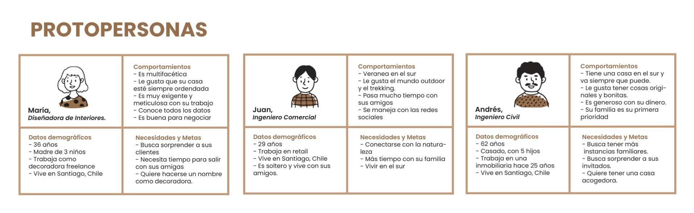
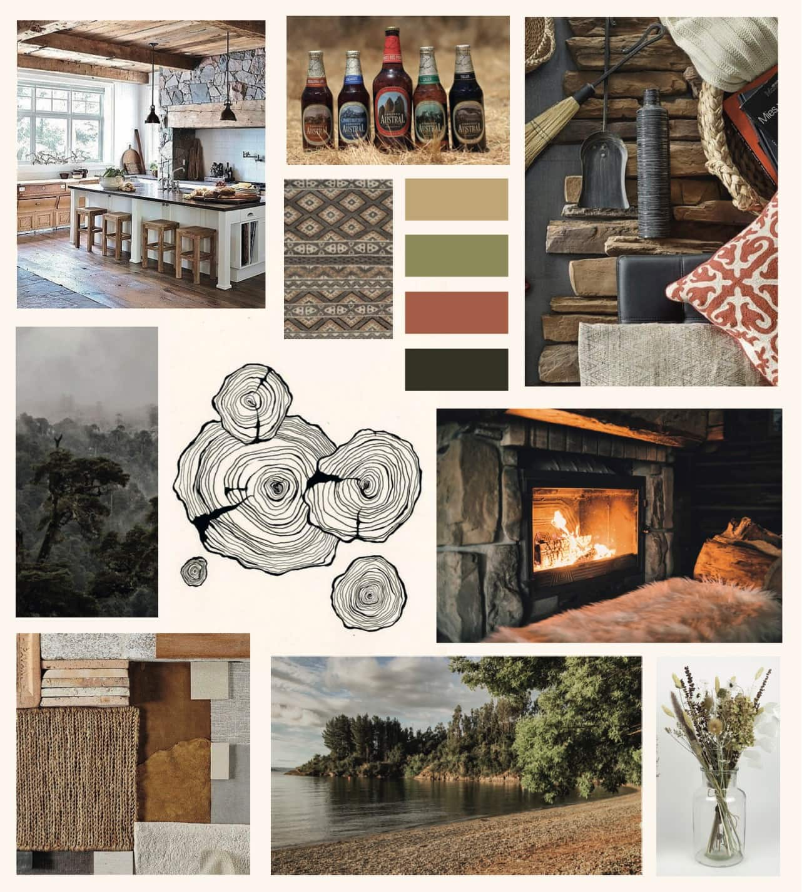

# Examen

**¿Para qué?** 
Exponer el catálogo de Cucao Mapas, cuadros de madera con mapas de los lagos del Sur de Chile que muestran sus profundidades batimétricas.

**¿Para quiénes?**

**¿Qué existe que es similar a la propuesta?**

https://www.3dwoodmaps.com/ Fue mi primera inspiración para comenzar con estos mapas. Tienen muchos tipos de mapas y es interesante como los muestran en sus distintos formatos y tamaños. Tiene un diseño muy sencillo.

https://www.pytm.cl/ Venden mapas pineables. Su página se ve saturada con imágenes de mapas en tonos claros, sin embargo está bien ordenada y es agradable a la vista.

https://mapasdelsur.com/ Venden mapas del sur de Chile. Su página es muy sencilla. Blanca, con letras negras y una barra superior color azul marino.

https://www.posterhouse.cl/ Venden posters de distintos tipos. Me gusta cómo logran que sus cuadros se vean elegantes. La página tiene muchas imágenes.

https://mappin.cl/ Emprendimiento de láminas de diferentes mapas. Tienen del mundo, de Chile, ilustrados, pineables, entre otros. La pagina es colorida y saturada de información. Es interesante el dinamismo que tienen los elementos que al poner el cursor sobre ellos cambia la imagen.

https://eco-wood-art.com/en/ Venden puzzles mecánicos y juguetes de madera hechos con corte laser. Su página es minimalista. El enfoque está en sus productos.

**¿Qué existe que puede inspirar la propuesta?**

