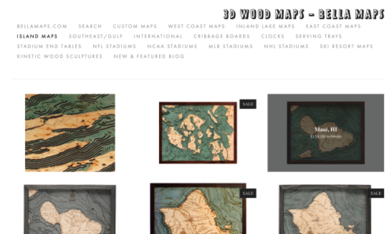
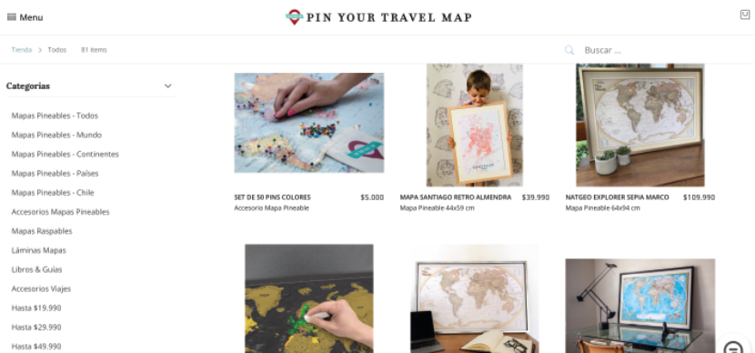
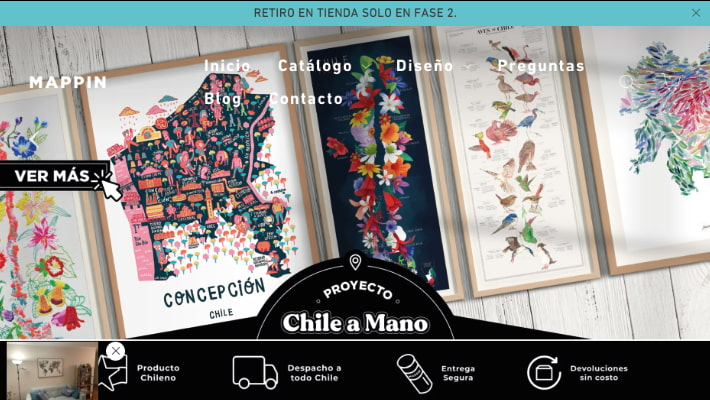
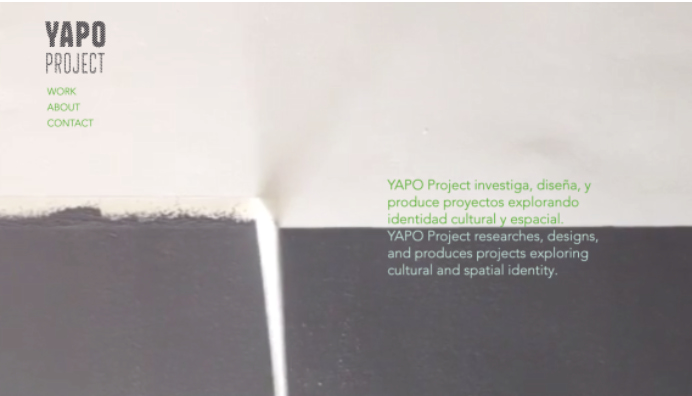
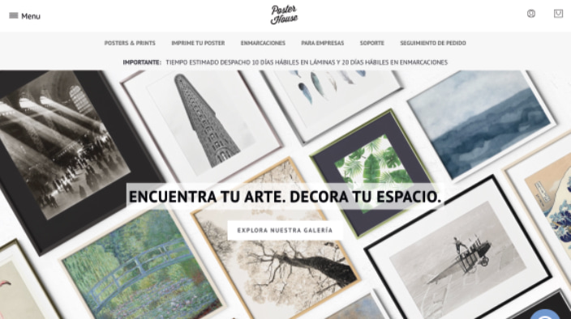

# H1 Examen

# H2 **¿Para qué?** 

Exponer el catálogo de Cucao Mapas, cuadros de madera con mapas de los lagos del Sur de Chile que muestran sus profundidades batimétricas.

# H2 **¿Para quiénes?**

# H2 **¿Qué existe que es similar a la propuesta?**

https://www.3dwoodmaps.com/ 

3D WOODMAPS

3DWoodMaps es una tienda estadounidense que fue mi primera inspiración para comenzar con estos mapas. Tienen muchos tipos de mapas de distintos lagos, costas de Estados Unidos, además de otros productos como relojes, cuadros de estadios, montañas, entre otros. 

*Aspectos positivos*
Es interesante como organizan los mapas en las diferentes categorías. Además tiene un diseño muy sencillo, lo que hace que se ponga todo el foco de atención en los productos. 
Al poner el mouse sobre el mapa, automaticamente la función de hover muestra el nombre del lugar y el precio, sin necesidad de tener que clickear sobre el producto, esto hace una navegación más rápida por la página y es más cómodo para el usuario.

*Aspectos negativos*
La disposición de las categorías se ve un poco saturada y es de difícil lectura para encontrar rápidamente lo que estoy buscando. 
Casi todos los mapas tienen la etiqueta de "Sale", lo que hace que se pierda la confianza en ese descuento (si todos estan en oferta siempre, el precio de oferta es el precio real).

https://www.pytm.cl/

PIN YOUR TRAVEL MAP

Es una tienda chilena donde venden mapas pineables y raspables, láminas, libros y guías de viajes. 

*Aspectos Positivos*
La página tiene una consistencia cromática, además está bien organizada y es de fácil navegación. 

*Aspectos Negativos*
Las imagenes de los mapas son todas diferentes y están puestas en contexto, hay unas fotos que son un zoom al mapa, otras del mapa instalado en el living, otras de niños con los mapas, etc. Esto si bien es bueno para el detalle del producto, para la disposición de todos los mapas se ve desordenado y me parece preferible poner el mapa solo sin fondo. 

https://mapasdelsur.com/ 
Son competencia directa, venden mapas del sur de Chile de diferentes tipos, hechos a mano, cartas náuticas y láminas. 

*Aspectos Positivos*
Su página es ordenada. Hay una consistencia en el tipo de fotos (a excepción de un par que se salen de la línea). 
Los productos agotados tienen una etiqueta y están expuestos con opacidad. Esto es un mensaje claro para los usuarios. No es necesario que apreten el producto para darse cuenta de que no está disponible.
Los productos agotados tienen una etiqueta y están expuestos con opacidad. Esto es un mensaje claro para los usuarios. No es necesario que apreten el producto para darse cuenta de que no está disponible.

*Aspectos Negativos*
Al ser tan simple y sencilla, tiene poca identidad visual. Podría ser un catálogo de cualquier producto. No rescata la escencia sureña.

https://mappin.cl/ 

MAPPIN

Emprendimiento de láminas de diferentes mapas. Tienen del mundo, de Chile, ilustrados, pineables, entre otros. 

*Aspectos Positivos*
La pagina es colorida y tiene una identidad gráfica clara. Es interesante el dinamismo que tienen los elementos, al poner el cursor sobre ellos cambia la imagen.
Muestra evaluaciones de otros usuarios que han comprado.

*Aspectos Negativos*
Tiene muchas imagenes y colores lo que hacen que se vea muy saturada. 

https://www.yapoproject.cl/

YAPO PROJECT

Ofrece servicios de contenido editorial, dirección de arte, y gestión cultural para clientes y también inicia sus propios proyectos. Su objetivo es explorar la identidad cultural y espacial.

*Aspectos Positivos*
Tiene una identidad gráfica muy potente y original. 
Está en inglés y español, por lo que es más inclusiva.

*Aspectos Negativos*
No hay categorización en sus productos o un buscador, lo que hace difícil encontrar lo que busco.

https://www.posterhouse.cl/ 

POSTER HOUSE

Venden posters de distintos tipos. 

*Apectos Positivos*
Me gusta cómo logran que sus cuadros se vean elegantes. Es una página ordenada, todas las imagenes siguen el mismo formato. Su página es dinámica con imagenes que tienen movimiento.

*Aspectos Negativos*
La portada tiene demasiadas imagenes e información, se ve un poco saturado.

# H2 **¿Qué existe que puede inspirar la propuesta?**

En la imagen de la cocina se destaca el aspecto rústico y a la vez ordenado y limpio del ambiente.
De la marca de cervezas Austral con su línea patagonia destaco la identidad gráfica y cómo utilizan las imagenes de la patagonia a su favor.
De las imagenes de la naturaleza me llama la atención como logran plasmar la escencia sureña, casi se siente el olor a sur con verlas.
Puse también esa chimenea pues refleja la calidez que quiero para mi proyecto.
Además incluí diferentes texturas y patrones relacionadas con lo rústico, artesanal y hecho a mano, que es parte de mi propuesta de valor.
Las flores secas de la esquina las puse porque me llama la atención lo simple y elegante que una decoración natural se puede llegar a ver.
Finalmente puse la paleta de colores que se desprende de esta recolección de elementos gráficos.

